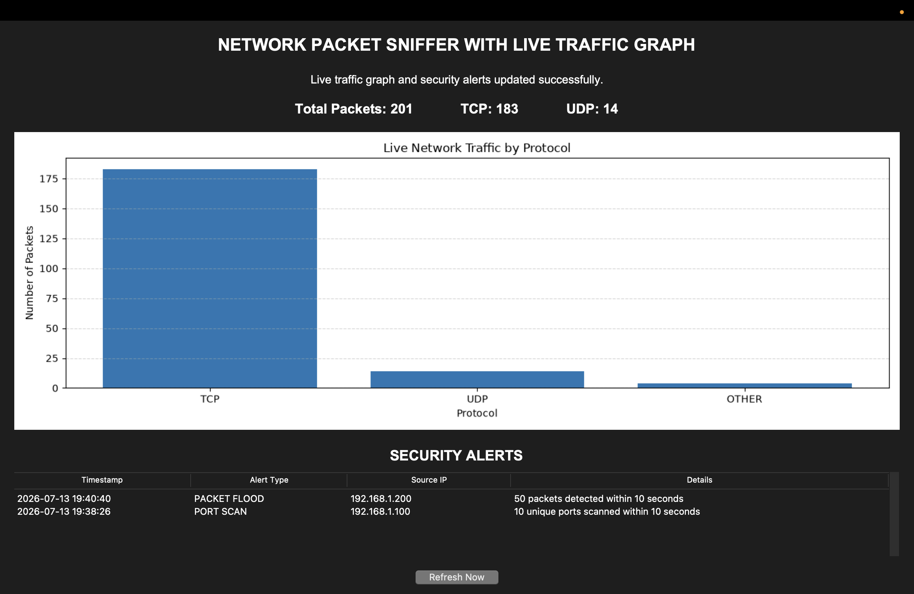

# Network Packet Sniffer with Security Monitoring Dashboard

A Python-based **Network Packet Sniffer and Security Monitoring System** that captures live network traffic, analyzes packet information, stores packet data in an SQLite database, detects suspicious network activity, and displays real-time traffic statistics through an interactive graphical dashboard.

This project demonstrates practical concepts in **cybersecurity, network traffic analysis, packet inspection, threat detection, database management, and real-time data visualization**.

---

## Features

- Live network packet capturing using **Scapy**
- Analysis of TCP, UDP, and other network protocols
- Extraction of source IP, destination IP, source port, and destination port
- Storage of captured packet information in an **SQLite database**
- Detection of possible **port scanning activity**
- Detection of possible **packet flooding attacks**
- Built-in security alert testing
- Real-time graphical dashboard using **Tkinter**
- Live traffic visualization using **Matplotlib**
- Automatic dashboard refresh
- Security alerts table for suspicious network activity

---

## Technologies Used

- **Python 3**
- **Scapy** — Network packet capturing and analysis
- **SQLite3** — Local database storage
- **Tkinter** — Graphical user interface
- **Matplotlib** — Real-time data visualization

---

## Project Structure

```text
Network-Packet-Sniffer/
│
├── packet_sniffer.py
├── traffic_gui.py
├── requirements.txt
├── .gitignore
├── README.md
└── network-packet-sniffer-dashboard.png
```

> **Note:** The `packet_logs.db` SQLite database file is automatically generated when the application runs and is not included in the repository.

---

## Installation

### 1. Clone the Repository

```bash
git clone https://github.com/tanimnaha/Network-Packet-Sniffer.git
cd Network-Packet-Sniffer
```

### 2. Create a Virtual Environment

```bash
python -m venv venv
```

### 3. Activate the Virtual Environment

#### macOS / Linux

```bash
source venv/bin/activate
```

#### Windows

```bash
venv\Scripts\activate
```

### 4. Install Required Dependencies

```bash
pip install -r requirements.txt
```

---

## How to Run

Because packet capturing requires access to network interfaces, administrator or root privileges may be required.

### Start the Packet Sniffer

#### macOS / Linux

```bash
sudo python packet_sniffer.py
```

#### Windows

Run Command Prompt or PowerShell as Administrator, then execute:

```bash
python packet_sniffer.py
```

### Start the Security Monitoring Dashboard

Open another terminal window, activate the virtual environment again, and run:

```bash
python traffic_gui.py
```

The dashboard will automatically read captured network traffic and security alerts from the SQLite database.

---

## Security Detection Mechanisms

### Port Scan Detection

The system monitors destination ports contacted by each source IP address.

A possible port scan alert is generated when a single source IP contacts **10 or more unique destination ports within 10 seconds**.

This behavior may indicate that a system is attempting to discover open ports or available services on a target machine.

### Packet Flood Detection

The system monitors the number of packets received from each source IP address.

A possible packet flood alert is generated when a single source IP sends **50 or more packets within 10 seconds**.

This may indicate unusually high traffic or possible flooding behavior.

> These threshold-based mechanisms are intended for educational and demonstration purposes and may produce false positives in real-world network environments.

---

## Dashboard Preview



The dashboard displays:

- Total captured packets
- TCP packet count
- UDP packet count
- Other protocol packet count
- Real-time protocol distribution chart
- Recent network traffic
- Security alerts and suspicious activity

---

## Database Storage

Captured packet information and security alerts are stored locally in an **SQLite database** named:

```text
packet_logs.db
```

The database is automatically created when the packet sniffer is executed.

It stores information such as:

- Timestamp
- Source IP address
- Destination IP address
- Network protocol
- Source port
- Destination port
- Packet length
- Security alert information

The database file is excluded from version control because it contains runtime-generated network traffic data.

---

## Testing Security Alerts

The project includes built-in testing functionality that allows security alerts to be generated for demonstration and testing purposes.

This makes it possible to verify the security monitoring dashboard without performing any real attack against a network or device.

---

## Ethical and Legal Notice

This project is intended strictly for **educational purposes, cybersecurity learning, and authorized network monitoring**.

Only use this software on:

- Networks you own
- Systems you control
- Networks or systems for which you have explicit permission to monitor

Unauthorized packet capturing or network monitoring may violate privacy laws, organizational policies, or applicable regulations.

---

## Future Improvements

Possible future enhancements include:

- Advanced packet filtering
- Exporting captured traffic to CSV
- Configurable security detection thresholds
- Additional intrusion detection mechanisms
- Improved false-positive reduction
- Automated unit testing
- More advanced real-time analytics and visualization

---

## Author

**Tanim Naha**

B.Tech Computer Science and Engineering  
Amity University Kolkata

- GitHub: [tanimnaha](https://github.com/tanimnaha)
- LinkedIn: [Tanim Naha](https://www.linkedin.com/in/tanim-naha-8b2759277)

---

## Disclaimer

This project was developed for educational purposes to demonstrate practical concepts related to network packet analysis, cybersecurity monitoring, suspicious traffic detection, database storage, and real-time visualization.
